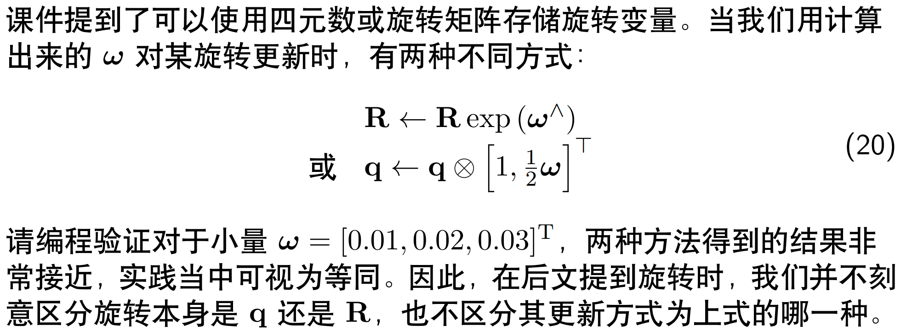
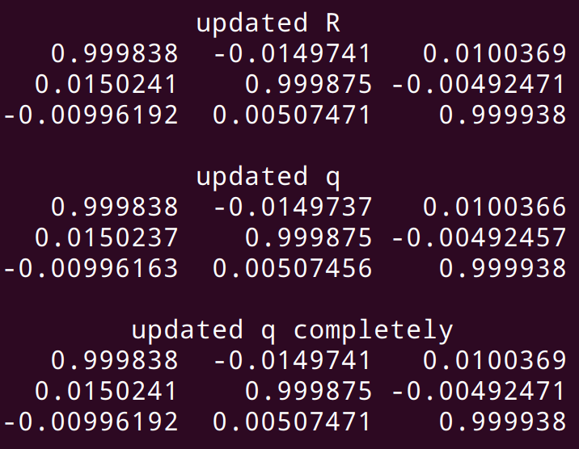
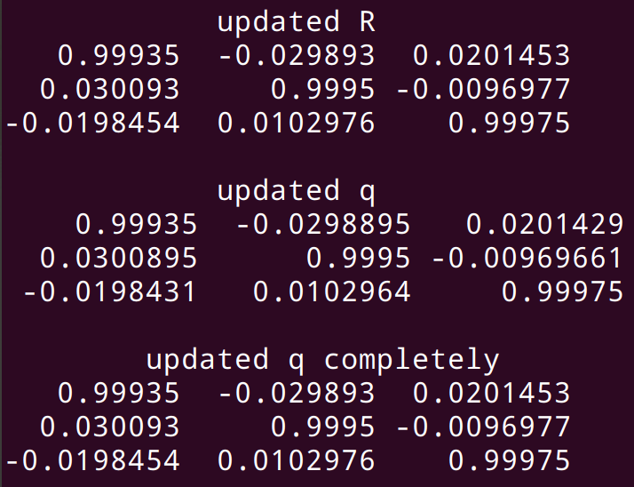
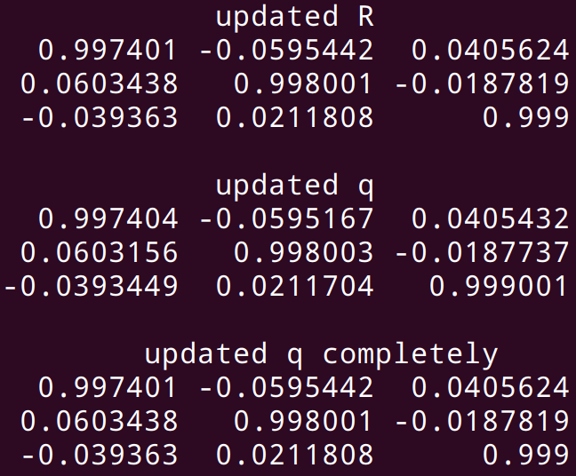
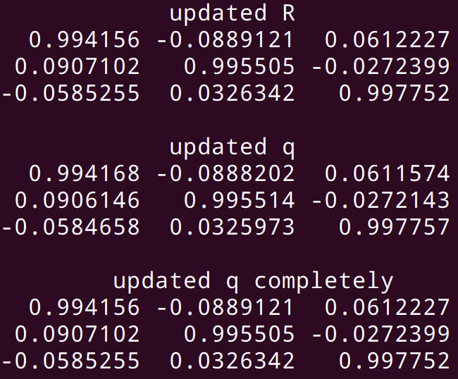
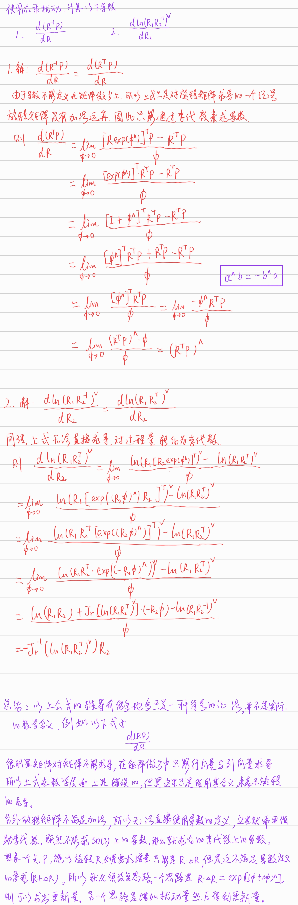

# 实验结果

## 1. VIO综述阅读

略

## 2. 四元数和李代数的更新



在更新旋转量时，可以通过给旋转矩阵增加微小扰动，也可以通过四元数乘以扰动量。

对于四元数的更新严格的计算方法如下：

给定某个旋转运动的旋转轴为单位向量$u$，绕该轴的旋转角度为$\theta$，转换为四元数的完整公式如下：
$$
q = 
\left[ 
\begin{matrix} 
\cos \frac{\theta}{2} \\
u \sin \frac{\theta}{2}
\end{matrix} 
\right]
$$
在实际应用中，当旋转角度$\theta$为一个小量时候，上式可以简化为：
$$
q = 
\left[ 
\begin{matrix} 
1 \\
u \frac{\theta}{2}
\end{matrix} 
\right]
$$
为了验证这种近似是正确的，于是编写了代码进行测试

代码运行方法

```shell
cd lecture_1_introduction/code
mkdir build 
cd build 
cmake ..
make 
```

运行结果如下：(其中原始旋转矩阵R为单位矩阵)

|                        2.14381 degree                        |                        4.28762 degree                        |
| :----------------------------------------------------------: | :----------------------------------------------------------: |
|  |  |
|                        8.57525 degree                        |                        12.8629 degree                        |
|  |  |

通过上表可以发现，施加的旋转角度达到8.5度时，还依然可以保持小数点后四位的精度相同，说明对于四元数的近似对于计算而言是可接受的。

## 3. 推导导数

