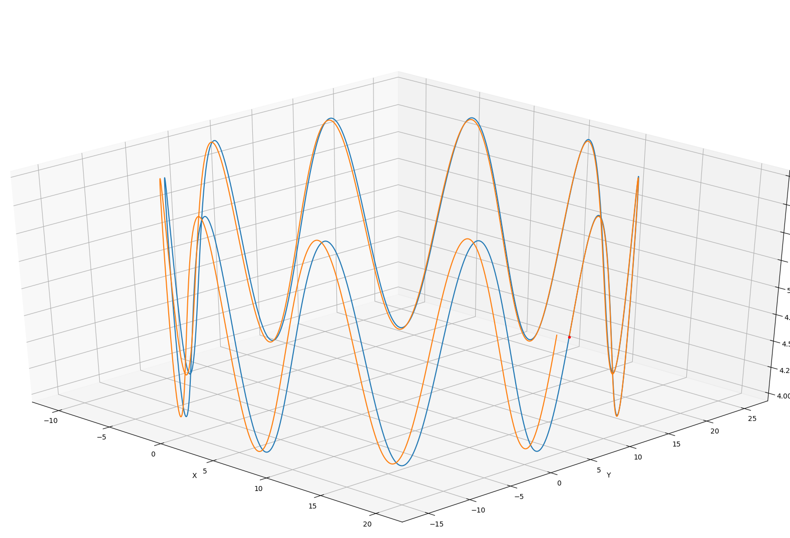
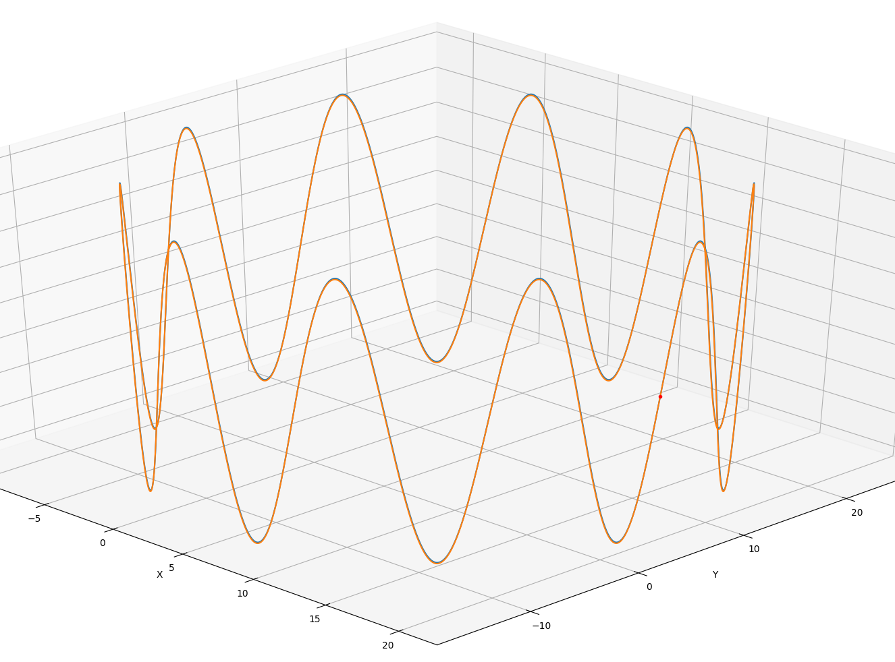

# 实验结果

## 1. 对比中值积分和欧拉积分

**编译和运行**

```shell
# 编译
cd lecture_2_IMU_motion_measurement/code/vio_data_simulation
./build.sh

# 运行
cd lecture_2_IMU_motion_measurement/code/vio_data_simulation/bin
./data_gen

# 轨迹显示
cd lecture_2_IMU_motion_measurement/code/vio_data_simulation//python_tool
python draw_trajcory.py
```

**实验结果**

通过对没有噪声的IMU的仿真数据进行轨迹推算，对比使用中值积分和欧拉积分之后，发现欧拉积分误差比较明显，而中值积分误差非常小。

|                          欧拉积分                          |                       中值积分                        |
| :--------------------------------------------------------: | :---------------------------------------------------: |
|  |  |

## 2. 使用Allen方差曲线标定仿真数据的IMU参数

首先，运行仿真程序生成imu bag数据：

```shell
# 编译
cd lecture_2_IMU_motion_measurement/code/vio_data_simulation-ros_version
catkin_make -j8
source devel/setup.bash

# 运行，将会在家目录下生成imu.bag
rosrun vio_data_simulation vio_data_simulation_node
```

在仿真数据中，使用的imu噪声参数如下：(IMU频率：200 Hz)

|            Parameter             |  连续   |      离散       |
| :------------------------------: | :-----: | :-------------: |
|     Gyroscope "white noise"      |  0.015  |     0.2121      |
|   Accelerometer "white noise"    |  0.019  |     0.2687      |
|   Gyroscope "bias Instability"   | 0.00005 | 3.536 x 10^(-6) |
| Accelerometer "bias Instability" | 0.0005  | 3.536 x 10^(-5) |

> 离散方法的计算公式参考PPT p28~30

### 2.1 imu_utils标定

```yaml
Gyr:
   unit: " rad/s"
   avg-axis:
      gyr_n: 2.0806514710476121e-01
      gyr_w: 8.4241715308181093e-04
   x-axis:
      gyr_n: 2.1132149851092055e-01
      gyr_w: 9.6754332143039691e-04
   y-axis:
      gyr_n: 2.0861944677211314e-01
      gyr_w: 7.6717719289936669e-04
   z-axis:
      gyr_n: 2.0425449603124995e-01
      gyr_w: 7.9253094491566931e-04
Acc:
   unit: " m/s^2"
   avg-axis:
      acc_n: 2.6919539114469621e-01
      acc_w: 3.4183440525492599e-03
   x-axis:
      acc_n: 2.6814448531935253e-01
      acc_w: 3.3787402525454631e-03
   y-axis:
      acc_n: 2.7117617826113871e-01
      acc_w: 3.4678666738335870e-03
   z-axis:
      acc_n: 2.6826550985359726e-01
      acc_w: 3.4084252312687291e-03
```

**结论**：发现高斯白噪声的标定结果比较正确，但是bias的高斯白噪声估计的误差较大，与真实值相差较多。

### 2.2 Kalibr

TODO：需要安装Matlab，暂时不做！