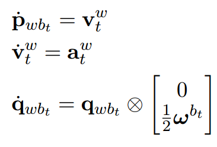
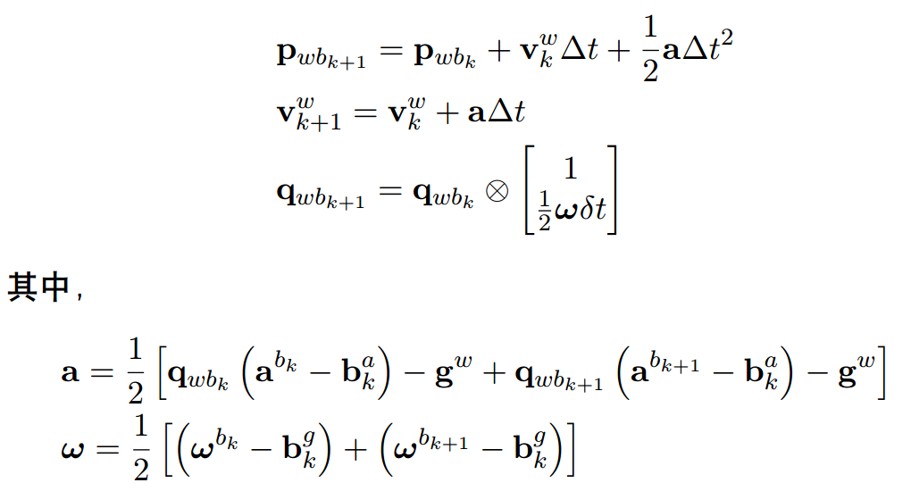

# 总结

## 1. 旋转运动学

**科式力：**科式力是一种惯性力，在旋转坐标系下，当运动不沿着旋转轴时，就会有一种隐形的力，让惯性系下的直线运动，在旋转坐标系下看起来是一个复杂的曲线运动。

> 参考：科里奥利力的物理解释是什么？ - 武奘的回答 - 知乎
> https://www.zhihu.com/question/22114513/answer/206245630

**IMU测量角速度**：对于IMU传感器，如果IMU内部可以有一个速度v确定的直线运动，那么当IMU发生旋转时，就会产生科式力，那么此时通过敏感到的科式力，就可以反算出IMU的角速度。

## 2. IMU误差模型

IMU的误差实际上是比较多的，取决于实际使用IMU价格，对于比较贵的IMU，建模的误差可能会更复杂，而对于一般精度的IMU而言，多数情况着重考虑**bias、高斯白噪声、bias的高斯白噪声(bias随机游走)**

对于IMU误差模型的建模，课程中采用的是如下形式：
$$
\tilde w(t) = w(t) + b(t) + n(t)  \\
\dot b(t) = n_b(t) \tag {1}
$$
IMU的测量值被量化为真实值+bias+高斯白噪声的共同作用。并且bias变化是一个维纳过程。

在对（1）式进行离散化时，需要格外关注bias和高斯白噪声的离散化，具体过程参考PPT 25-30。

> 暂时还没有搞明白这其中的道理！

## 3. 运动模型离散时间处理

对于P(ose)、V(elocity)、Q(uaternion)，对时间的导数可写成：

> 对于微分形式的方程，当知道一个初值之后，可以很容易写出任意时刻的状态。

> 在PPT中给的中值积分方法如上图，实际上还可以进一步改进，对速度也同样使用中值，精度有比较明显的提升。

## 4. 总结

这一节中对于IMU误差模型的建模理解的不够透彻，后续应该再多花一些时间在误差模型的理解上，对于维纳过程，高斯白噪声等概念，再深入研究一下。
