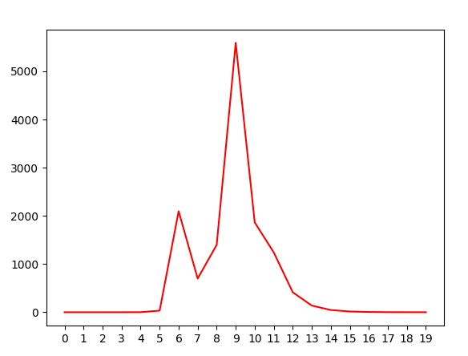
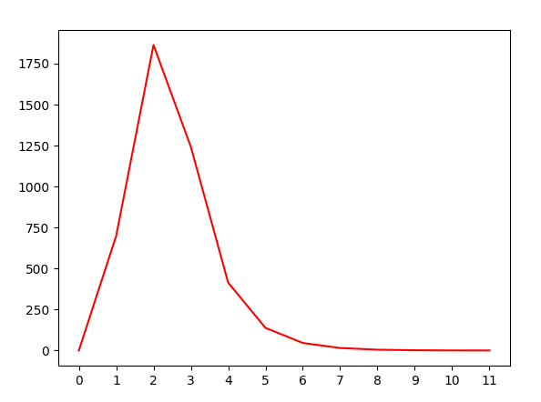
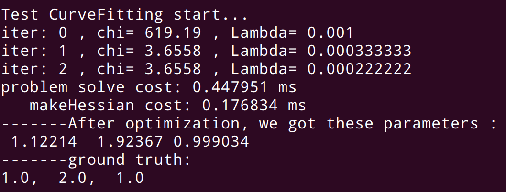

# 实验报告

## 1. 最小二乘问题求解

### 1.1 我的版本

**编译和运行**

```shell
## 编译
cd lecture_3_bundle_adjustment/my_code
mkdir build 
cd build
cmake -DCMAKE_BUILD_TYPE=Release ..
make -j4
## 运行
./fit_curve
```

为了更加深入的理解LM算法和图优化的思路，我自己写了一个版本的图优化，它主要仿照g2o的思路，顶点为优化变量，误差项为边。由于只是出于学习的目的，所以我的所有细节只是做了最简单的实现，没有考量实际工程应用，并且代码中肯定存在BUG，因为我只做了曲线拟合的测试。

通过拟合如下曲线：
$$
y = \exp(ax^2+bx+c)
$$
证明了实现的算法是可行的，实验结果如下：


**结论：**通过实验发现，即使最基础的LM算法就已经达到了不错的效果。

> TODO：在实现的过程中，我增加了cauchy鲁棒核函数，但是使用之后，优化得到了错误的结果。

### 1.2 课程中提供的版本

**A. 绘制LM的阻尼因子变换曲线**

|                  完整的阻尼因子变化                  |                    实际使用的阻尼因子变化                    |
| :--------------------------------------------------: | :----------------------------------------------------------: |
|  |  |

结论：从上面两幅图可以看出阻尼因子先增大，也就是说LM先以接近最速下降的方法进行迭代，然后阻尼因子减小，则相当于使用的是高斯牛顿进行迭代计算。左边的图是完整的变化过程，由于迭代的过程中，阻尼因子过大导致代价函数没有下降，因此就放弃了该次迭代。

**运行阻尼因子绘制程序**

运行LM算法之后，将在运行路径下自动生成`.txt`文件，使用以下指令即可以完整绘制。

```shell
cd lecture_3_bundle_adjustment/utils
python draw_mu.py -f {workspace}/code/build/app/mu.txt
```

**B. 修改拟合的曲线方程为:y = ax^2 + bx + c**

> 运行方法：将文件lecture_3_bundle_adjustment/code/app/CurveFitting.cpp中的第8行的注释取消，然后进行编译运行。

该残差方程的雅克比矩阵如下：
$$
J = [x * x, x , 1]
$$
迭代结果如下：



结论：由于该函数形式很简单，所以迭代收敛的很快。但是由于函数值本身很小，所以容易受到噪声的影响，因此收敛的结果看起来并不是非常好。

> 可参看论文：《The Levenberg-Marquardt algorithm for nonlinear least squares curve-fitting problems》(在doc目录下)

## 2. 公式证明

TODO：由于我之前在本子上推导过一遍，但是本子找不到了，本身推导也不难，所以我懒得再做一遍了，哈哈。
