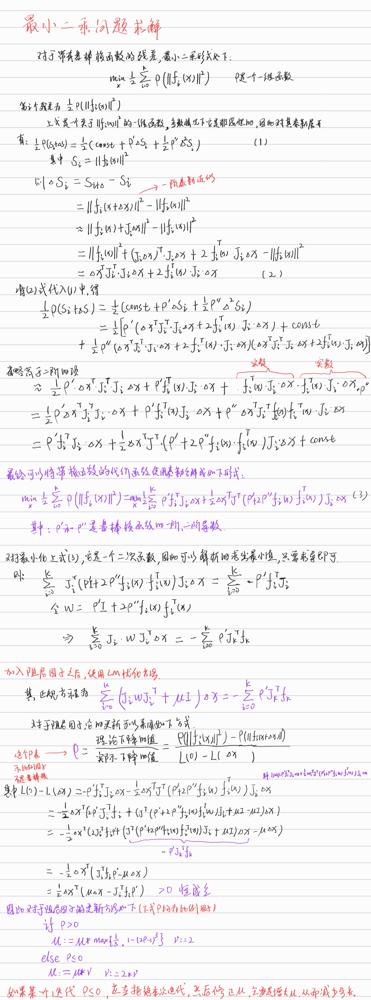

# 总结

这一章节的内容非常多，牵扯到的理论较多，公式也非常多，其推导过程也比较复杂，所以理解其原理，理清逻辑是非常重要的。

## 1. 最小二乘问题求解

对于最小二乘问题的思路总结如上，其细节比较多，要想充分理解其过程和原理，应当通过编写程序对其进行实现。

## 2. VIO残差函数的构建

在基于滑窗的VIO中，其误差由三部分组成：①滑动窗口之前传递过来的误差；②IMU的误差；③重投影误差。

### 2.1 需要优化的状态量

在滑动窗口中，待优化的变量包括：位置、姿态、速度、加速度计的bias、陀螺仪的bias、逆深度。

### 2.2 预积分

在VIO的优化中，只会优化关键帧处相关的变量，而对于两个关键帧之间的所有IMU并不会进行优化。因此如果第i个关键帧的状态发生变化，那么就势必需要重新计算i到j之间的IMU积分量，这势必浪费了很多的计算量。预积分的引入就是为了从IMU的积分中，分离出与i时刻运动状态无关的量，从而对于积分量只需要计算一次，当i时刻的姿态发生变化时，直接将预积分量带入重新计算即可。更通俗的去解释预积分，它其实就是计算i和j之间的相对增量。

### 2.3 残差

**重投影误差**：对于图像的重投影误差是比较容易理解的，它主要就是关键帧的观测和投影的差值。而会影响到投影的状态量包括：关键帧的位置、姿态、特征点的逆深度，以及IMU和相机之间的外参(这个也可以不估计)。以此在求雅克比矩阵时需要对这些状态量就行求导的，别的无关状态量的导数为0。

**IMU误差**：这里对于IMU误差的理解需要多留心。例如i和j时刻的两个关键帧它们具有一个不太准确的位姿估计，它俩的位姿主要是来自于特征点匹配，因为特征点匹配是具有误差的，所以这个位子并不准确，而IMU的积分也能得到关键帧的位姿，它们都不准，因此关键帧的位姿变化和IMU的积分就有了差异，于是就构建了IMU的误差函数。

### 2.4 预积分量的方差

对于关键帧之间的IMU数据，它们在积分的过程中，其方差也在不断地变化，只有知道了最后一帧IMU对应的累积方差，才能知道IMU积分结果的可靠性，在融合优化的时候，也能判断IMU的优化程度。

对于线性传递方程，误差的传递方程由两部分组成，一个是当前的误差传递给下一时刻，另一个是测量噪声传递给下一时刻。其传递过程的方程参看PPT中的公式(35)。

因此要想知道IMU在积分的过程中误差是怎么传递的，就必须写出IMU的线性传递过程。对于非线性的递推关系方程，可以有两种方法推导其状态误差传递的线性递推公式。

- 直接将非线性方程进行一阶泰勒展开；
- 基于误差随时间变化的递推方程。

通过对预积分的误差递推公式推导，可以获得在IMU积分的过程中，误差是如何传递的，具体计算过程参考PPT。

## 3. 残差Jacobian的推导

由于，需要对重投影误差、IMU的误差等进行优化，因此就需要推导它们Jacobian矩阵。根据VIO滑窗优化的要求，实际优化中关注的变量有：状态量(位置、姿态、速度、bias)、IMU和相机的外参数和特征点的逆深度。因此对于每一个残差项，都需要对以上变量进行求导，它们的过程比较复杂，需要花一些时间耐心的推导。

## 4. 总结

这一章节的内容比较多，并且很多内容比较难理解，应当先对其有一个比较完整的认识，在后续的工作中慢慢去理解其细节。

