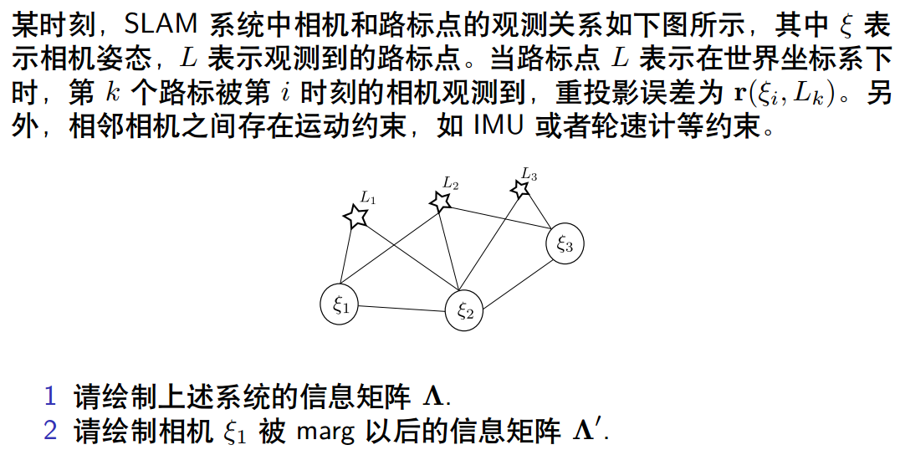
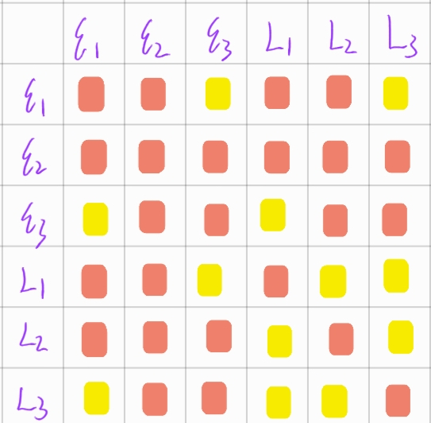
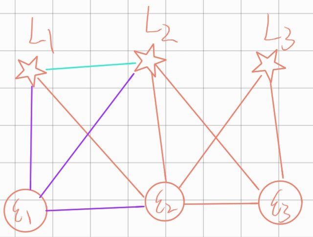
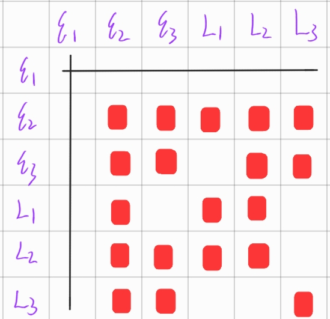

# 实验报告

## 1.绘制信息矩阵示意图

### **解 1：**

根据姿态的残差以及观测的残差可以发现，如果两个状态状态之间有残差，则必有关于状态量的雅克比(上图红色方块)，而两个无关的独立状态，它们之间的雅克比为0(如上图黄色方块).

**解 2：**

由于相机姿态被marg掉了，所有和该状态量相关的状态量都两两产生了相关，因此可以marg之后的关系如下图所示：

> 其中紫色的边是要删除，蓝色是新增加的关系。

对应的信息矩阵如下图所示：

## 2. 证明信息矩阵和协方差的逆之间的关系

参考论文：《Relationship between the Hessian and Covariance Matrix for Gaussian Random Variables》

## 3. 补充单目BA的信息矩阵，并计算其奇异值的最后7维是否接近于0

> 代码在：lecture_4_sliding_window/code/hessian_nullspace_test.cpp

代码的整体思路就是通过重投影误差对位姿和landmark的空间坐标求雅克比，然后构建海森矩阵。海森矩阵的构建方法还是比较直观的，有关系的状态之间就会在海森矩阵上产生数值。

> 奇异值结果：… 0.00520788  0.00502341   0.0048434  0.00451083   0.0042627  0.00386223  0.00351651  0.00302963  0.00253459  0.00230246  0.00172459 0.000422374 3.21708e-17 2.06732e-17 1.43188e-17 7.66992e-18 6.08423e-18 6.05715e-18 3.94363e-18

通过对海森矩阵求奇异值之后，其最后七个奇异值的数量级非常小，接近有。验证了BA问题的零空间有7维。一方面是路标点的尺度，另一方面是整个系统的绝对位姿。

**固定一个姿态**

当固定一个姿态之后，将不在对其进行优化，此时系统的零空间就剩下了一个。

> 奇异值结果：… 0.00424535  0.00384329  0.00369296  0.00277172  0.00236324    0.001771 0.000807304 0.000214582  6.4858e-05 3.66257e-17