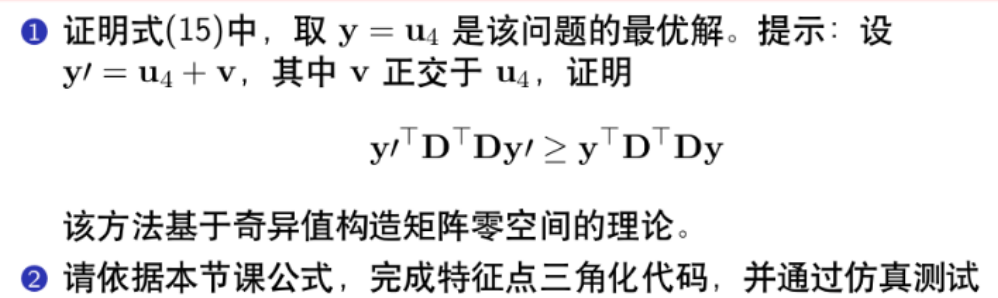
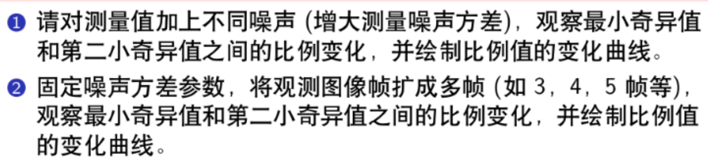

# 实验报告

此节的内容比较简单，基本都是一些经验性的问题，没有太多理论知识。

## 1. 基础题



①. 对于第一题的证明，实际上有多种方法，可以使用拉格朗日乘子，也可以使用SVD分解。我在博客中给出了非常完整的理论证明，可以参考博客：[《超定方程组的求解》](https://blog.csdn.net/u011341856/article/details/107758182?spm=1001.2014.3001.5501)

②.第二题的求解比较简单，需要注意代码中忽略了前三帧观测，因此构造矩阵D时注意大小。增加的代码如下：

```cpp
    Eigen::MatrixXd D;
    const unsigned int N = camera_pose.size() - start_frame_id;
    D.resize(2 * N, 4);
    for (unsigned int i = start_frame_id; i < end_frame_id; ++i) {
        const Eigen::Matrix3d &R = camera_pose[i].Rwc.transpose();
        const Eigen::Vector3d &t = -R * camera_pose[i].twc;
        const double &u = camera_pose[i].uv[0];
        const double &v = camera_pose[i].uv[1];
        Eigen::RowVector4d T_0;
        T_0 << R.block(0, 0, 1, 3), t[0];
        Eigen::RowVector4d T_1;
        T_1 << R.block(1, 0, 1, 3), t[1];
        Eigen::RowVector4d T_2;
        T_2 << R.block(2, 0, 1, 3), t[2];

        D.block(2 * (i - start_frame_id), 0, 1, 4) = u * T_2 - T_0;
        D.block(2 * (i - start_frame_id) + 1, 0, 1, 4) = v * T_2 - T_1;
    }

    Eigen::JacobiSVD<Eigen::MatrixXd> svd(D, Eigen::ComputeFullV | Eigen::ComputeFullU);
    const Eigen::MatrixXd &V = svd.matrixV();
    P_est = (V.col(3) / V(3, 3)).head(3);
```

运行结果如下：

> ground truth: 
>   -2.9477 -0.330799   8.43792
> your result: 
>   -2.9477 -0.330799   8.43792

注意：并没有采用PPT中提到的对$D^TD$求解svd，而是采用的直接对D进行svd求解，其原理按照我的博客实现的。

## 2.提升题



**①. 探索特征值比例与误差之间的关系**

| 噪声(m) | 0.00 |  0.001  | 0.002  | 0.005  |  0.01  |  0.02  | 0.05  |  0.1  | 0.2  |  0.3  |  0.5  |
| :-----: | :--: | :-----: | :----: | :----: | :----: | :----: | :---: | :---: | :--: | :---: | :---: |
|  比例   |  0   | 0.00227 | 0.0045 | 0.0113 | 0.0227 | 0.0454 | 0.114 | 0.228 | 0.45 | 1.85  | 8.06  |
|  误差   |  0   | 0.0023  | 0.0057 | 0.0142 | 0.028  | 0.055  | 0.13  | 0.247 | 0.63 | 0.664 | 0.749 |

> 其中，`比例`：特征值最小除以倒数第二小；`噪声`：对应归一化平面的测量误差，例如：0.01实际表示在1m的归一化平面上测量值的标准差是0.01m.

**结论：**比例与误差直接成正相关，当比例小于两个数量级时误差基本在厘米级别，当比例继续增大，误差急剧增加。因此可以通过比例来判断当前特征点的三角化是否优异。

**②. 探索关键帧数量与特征值比例的关系**

| 图像帧数量 |     3      |     5      |   7    |     9      |    11     |    13     |    15     | 22        |
| :--------: | :--------: | :--------: | :----: | :--------: | :-------: | :-------: | :-------: | --------- |
|    比例    | 0.00896339 | 0.00797258 | 0.0113 | 0.00989456 | 0.0112499 | 0.0113634 | 0.0105968 | 0.0112566 |
|    误差    | 0.0115492  | 0.0200348  | 0.0142 | 0.0237108  | 0.0142342 | 0.0387967 | 0.0246673 | 0.0397709 |

> 上表对应噪声为0.005m

| 图像帧数量 |     2      |     4      |     6      |     8      |     10     |     12     |     14     |
| :--------: | :--------: | :--------: | :--------: | :--------: | :--------: | :--------: | :--------: |
|    比例    | 0.0031245  | 0.00140899 | 0.00196605 | 0.00203809 | 0.00239766 | 0.00235977 | 0.00218168 |
|    误差    | 0.00179434 | 0.00791805 | 0.0111324  | 0.00205543 | 0.00070969 | 0.00944125 | 0.00677964 |

> 上表对应噪声为0.001m

**结论：**可以发现关键帧的数量在噪声比较小的时候，与比例和误差成负相关，也就是说增大观测数量，可以适当提高精度和比例。但是噪声比较大的时候，这种相关性就不明显了。