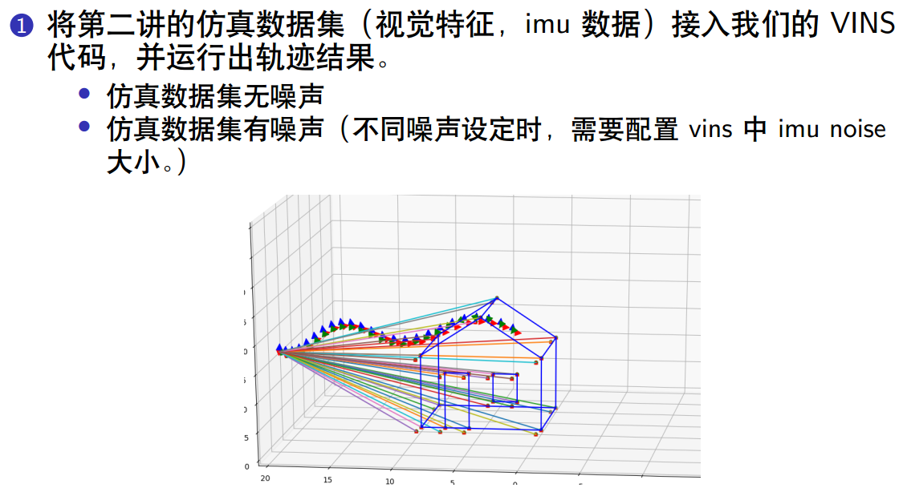
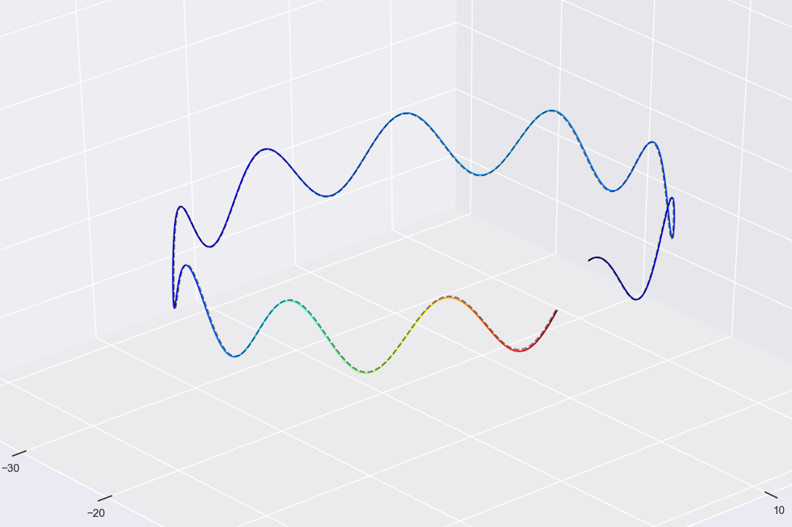
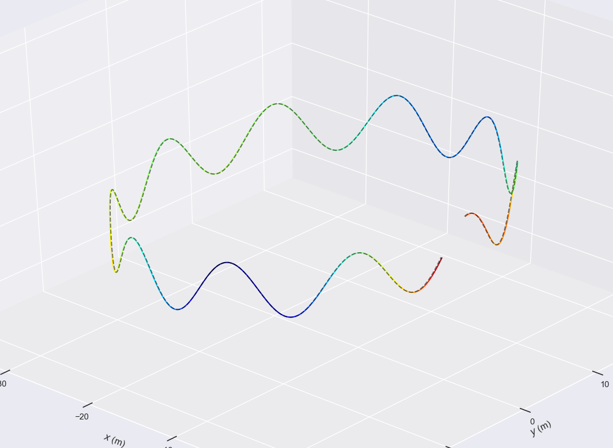
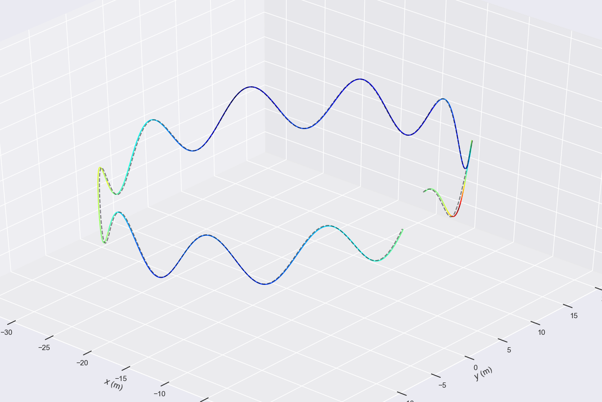
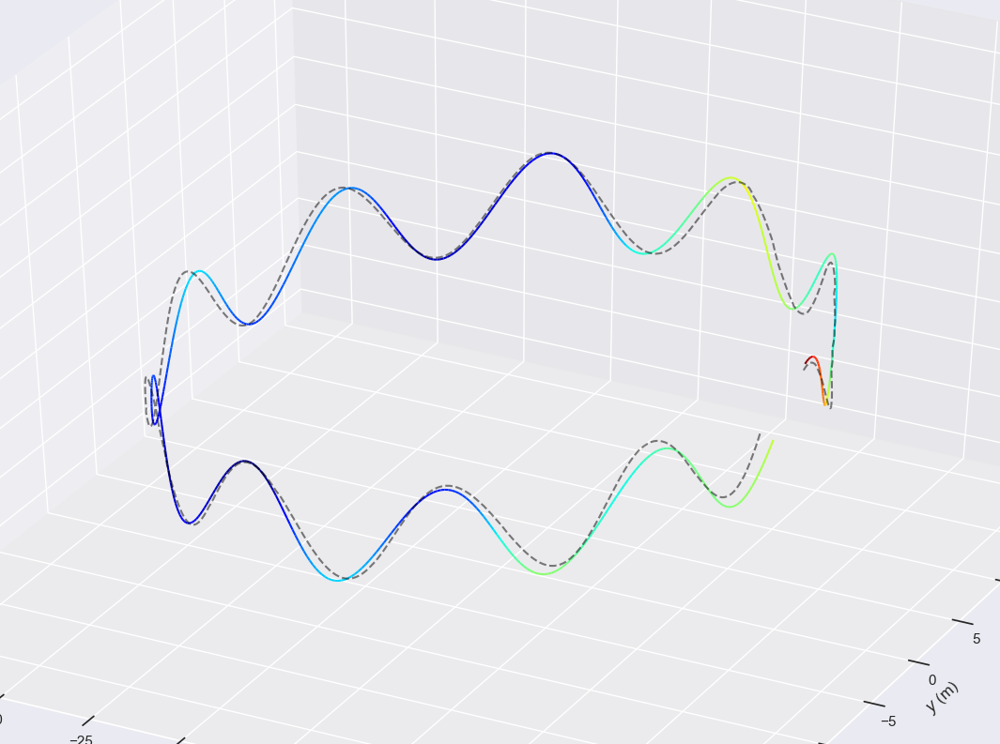

# 实验报告

## 1. 问题



**修改的代码**

由于没有图像作为输入，而是直接输入已经跟踪完成的特征点，因此对于vio系统可以把特征点提取的过程给省略掉。因此，在`System.cpp`中增加如下函数：

```cpp
void System::PubSimImageData(double dStampSec, const vector<cv::Point2f> &FeaturePoints) {
    if (!init_feature)//
    {
        cout << "1 PubImageData skip the first detected feature, which doesn't contain optical flow speed" << endl;
        init_feature = true;
        return;
    }

    if (first_image_flag)//
    {
        cout << "2 PubImageData first_image_flag" << endl;
        first_image_flag = false;
        first_image_time = dStampSec;
        last_image_time = dStampSec;
        return;
    }
    // detect unstable camera stream 发现时间戳不连续甚至倒退，提示重新输入
    if (dStampSec - last_image_time > 1.0 || dStampSec < last_image_time) {
        cerr << "3 PubImageData image discontinue! reset the feature tracker!" << endl;
        first_image_flag = true;
        last_image_time = 0;
        pub_count = 1;
        return;
    }
    last_image_time = dStampSec;
    // frequency control 控制频率设定小于某一阈值
//    if (round(1.0 * pub_count / (dStampSec - first_image_time)) <= FREQ)
//    {
//        PUB_THIS_FRAME = true;
//        // reset the frequency control TODO question:若当前连续图像序列的频率与 FREQ=10 误差在一定范围内重置？
//        if (abs(1.0 * pub_count / (dStampSec - first_image_time) - FREQ) < 0.01 * FREQ)
//        {
//            first_image_time = dStampSec;
//            pub_count = 0;
//        }
//    }
//    else
//    {
//        PUB_THIS_FRAME = false;
//    }
    PUB_THIS_FRAME = true;

    TicToc t_r;
    // cout << "3 PubImageData t : " << dStampSec << endl;
    // TODO Bookmark:获取图像特征点
//    trackerData[0].readImage(img, dStampSec);
//    trackerData[0].readPoints(FeaturePoints, dStampSec);

//    for (unsigned int i = 0;; i++)
//    {
//        bool completed = false;
//        completed |= trackerData[0].updateID(i);
//
//        if (!completed)
//            break;
//    }
    if (PUB_THIS_FRAME) {
        pub_count++;//pub进VINS的相机的个数
        shared_ptr<IMG_MSG> feature_points(new IMG_MSG());
        //这里的 IMG_MSG 的数据结构如下
        /* struct IMG_MSG {
             double header;
             vector<Vector3d> points;//相机下的3d点
             vector<int> id_of_point;//点对应的id
             vector<float> u_of_point;//像素u
             vector<float> v_of_point;//像素v
             vector<float> velocity_x_of_point;//u的速度
             vector<float> velocity_y_of_point;//v的速度
         };*/
        feature_points->header = dStampSec;//
        vector<set<int>> hash_ids(NUM_OF_CAM);
        //这里其实默认是1
        for (int i = 0; i < NUM_OF_CAM; i++) {
//            auto &un_pts = trackerData[i].cur_un_pts;// 去畸变的归一化图像坐标
//            auto &cur_pts = trackerData[i].cur_pts;// 当前追踪到的特征点
//            auto &ids = trackerData[i].ids;
//            auto &pts_velocity = trackerData[i].pts_velocity;
            //遍历相机的所有特征点
            for (unsigned int j = 0; j < FeaturePoints.size(); j++) {
//                if (trackerData[i].track_cnt[j] > 1)
//                {
//                    int p_id = ids[j];
                int p_id = static_cast<int>(j);
                hash_ids[i].insert(p_id);
                double x = FeaturePoints[j].x;
                double y = FeaturePoints[j].y;
                double z = 1;
                feature_points->points.emplace_back(x, y, z);
                feature_points->id_of_point.push_back(p_id * NUM_OF_CAM + i);
//                    feature_points->u_of_point.push_back(cur_pts[j].x); // 像素坐标
//                    feature_points->v_of_point.push_back(cur_pts[j].y);

//                    feature_points->velocity_x_of_point.push_back(pts_velocity[j].x);
//                    feature_points->velocity_y_of_point.push_back(pts_velocity[j].y);

                cv::Point2f pixel_point;//特征点对应的像素坐标
                pixel_point.x = 460.0f * static_cast<float>(x) + 255;
                pixel_point.y = 460.0f * static_cast<float>(y) + 255;

                feature_points->u_of_point.push_back(pixel_point.x); // 像素坐标
                feature_points->v_of_point.push_back(pixel_point.y);
//                这里默认速度为0不考虑
                feature_points->velocity_x_of_point.push_back(0);
                feature_points->velocity_y_of_point.push_back(0);
//                }
            }

            // skip the first image; since no optical speed on frist image
            if (!init_pub) {
                cout << "4 PubImage init_pub skip the first image!" << endl;
                init_pub = true;
            } else {
                m_buf.lock();
                feature_buf.push(feature_points);
                // cout << "5 PubImage t : " << fixed << feature_points->header
                //     << " feature_buf size: " << feature_buf.size() << endl;
                m_buf.unlock();
                con.notify_one();
            }
        }
    }
}
```

对于仿真数据的读取以及输入基本参照`run_euroc.cpp`，仿真数据还包含边特征，但是实际上本次实验并没有用到。仿真实验对应的执行文件为：`run_sim_data.cpp`.

**编译和运行**

```shell
# 编译
cd vio/lecture_7_initialization/VINS-Course
mkdir build
cd build
cmake ..
make -j4

# 运行
 ./run_sim_data /home/meng/codes_my/vio/lecture_7_initialization/VINS-Course/config/sim_config.yaml
```

**实验结果**

由于vio系统是一个对IMU噪声比较敏感的系统，因此可以修改不同的IMU噪声，从而观察噪声对系统的影响。

修改噪声：在文件`VINS-Course/include/generate_sim_data/param.h`中修改噪声参数，最主要修改是这两个变量：`gyro_noise_sigma, acc_noise_sigma`

注意修改了这里之后，还需要修改`config/sim_config.yaml`中的对应的`acc_n, gyr_n`

运行`run_sim_data`将会在`bin`文件夹下生成实验结果数据：

- cam_pose_tum.txt：相机的ground truth
- pose_output.txt：vio融合之后的结果

下面将探究不同噪声对VIO系统的影响，对于误差的评估使用evo中的APE

| 噪声                                                         | 误差(APE)                                                    |                        轨迹                        |
| :----------------------------------------------------------- | :----------------------------------------------------------- | :------------------------------------------------: |
| double gyro_noise_sigma = 0.0;<br />double acc_noise_sigma = 0.0; | max	0.298494<br/>      mean	0.115081<br/>    median	0.100312<br/>       min	0.048697<br/>      rmse	0.127736<br/>       sse	9.577818<br/>       std	0.055433 |   |
| double gyro_noise_sigma = 0.0001;<br />double acc_noise_sigma = 0.0002; | max	0.086127<br/>      mean	0.043935<br/>  median	0.047450<br/>          min	0.008672<br/>        rmse	0.046899<br/>            sse	1.291116<br/>            std	0.016408 |  |
| double gyro_noise_sigma = 0.0001;<br />double acc_noise_sigma = 0.0002; | max	0.248461<br/>      mean	0.093342<br/>    median	0.078561<br/>       min	0.023438<br/>      rmse	0.102951<br/>       sse	6.221549<br/>       std	0.043430 |  |
| double gyro_noise_sigma = 0.001;<br/>double acc_noise_sigma = 0.002; | max	1.473589<br/>      mean	0.528754<br/>    median	0.482183<br/>       min	0.085198<br/>      rmse	0.604323<br/>       sse	214.376282<br/>       std	0.292618 |  |

 **结论：**从上述的实验不难发现，当IMU的噪声增大的时候，融合结果将明显变差，说明VIO系统对于IMU的精度依赖还是比较高的。另外当输入的数据完全无噪声时，反而精度下降了，这一点很明显，当噪声为零时，信息矩阵变成无穷，此时优化器失效，数值不再稳定。

## 2. 运行EuRoc数据集

该代码还可以运行Euroc 05 difficulty数据集，其运行方法如下：

```shell
./run_euroc /media/meng/DATA/EuRoC/MH_05_difficult/mav0/ /home/meng/codes_my/vio/lecture_7_initialization/VINS-Course/config/euroc_config.yaml
```

